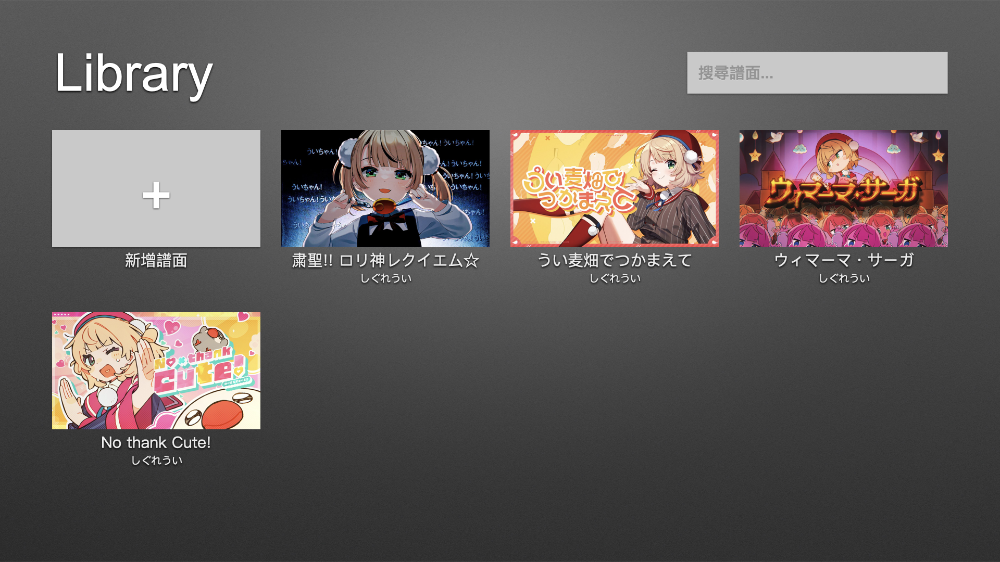
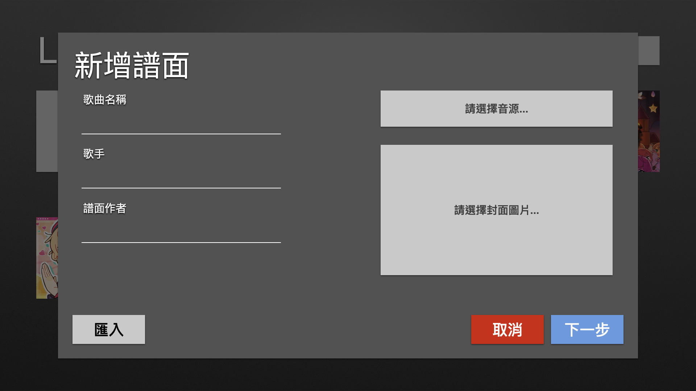
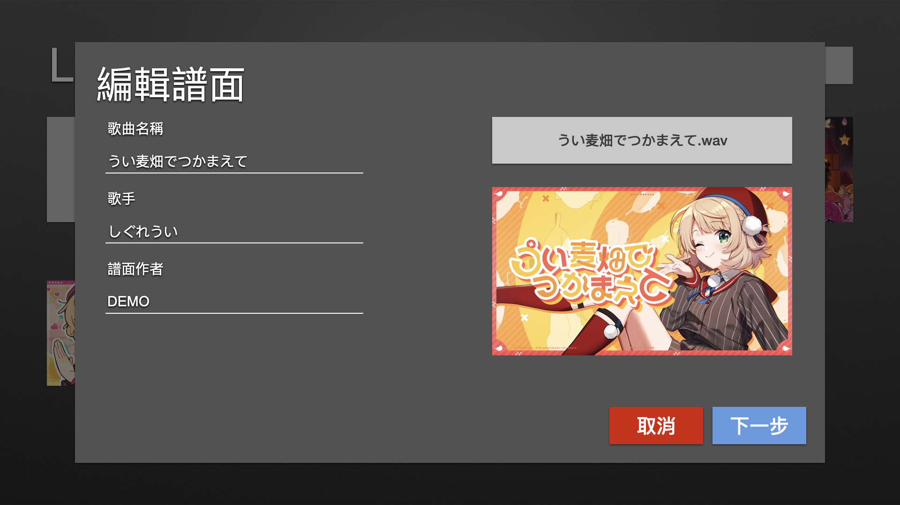
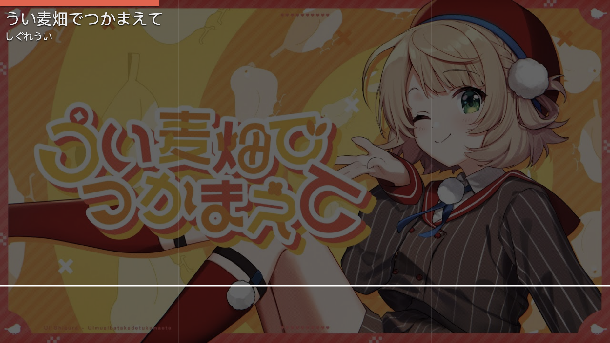
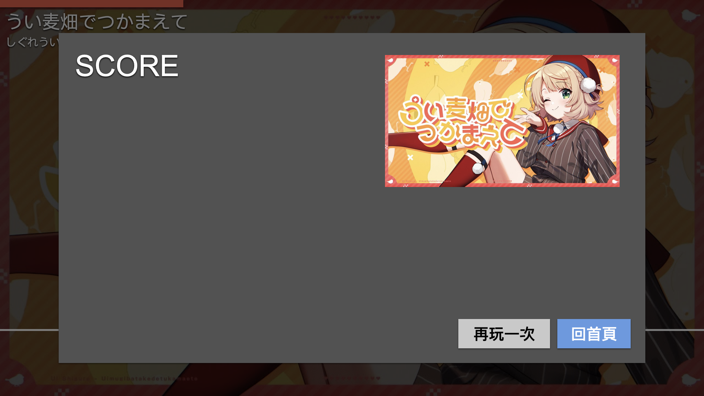

# JavaFinalProject_MusicGame_Testing
成功大學資訊工程系二年級下學期選修課「JAVA軟體開發」，第19組期末報告專案音樂遊戲

## 組員
陳梓銜 (F74136267)  
陳紀翰 (F74136241)  
韓睿宬 (E94136229)

## 設計目標
視窗大小固定為16:9的1920x1080，包含以下幾個主要UI部分：

- 畫面 - 首頁(LibraryView)  
- 彈窗 - 新增譜面(CreatePanel)  
- 彈窗 - 編輯譜面(EditPanel)  
- 畫面 - 譜面編輯器(EditorView)  
- 畫面 - 遊戲畫面(GameView)  
- 彈窗 - 成績結算(ScorePanel)  

>「畫面」是佔滿整個視窗的主要畫面  
>「彈窗」是覆蓋於主要畫面之上，大小稍小於主要畫面的資訊彈窗

### 各UI部分的功能：

1. 畫面 - 首頁(LibraryView)  
    - 程式開啟後的第一個畫面  
    - 左上角顯示Library字樣，右上角提供一個搜尋框  
    - 已儲存的歌曲由左至右由上至下，依修改時間排列，一列4個項目，歌曲封面顯示為400x225  
    - 歌曲封面圖片下方顯示歌曲標題與歌手
    - 左上角第一個固定為新增譜面的「+」按鈕
    - 搜尋譜面時，即時更新Library畫面，只顯示符合的結果
    - 於歌曲封面上按下右鍵時，提供「匯出」、「編輯」、「刪除」三個選項
    - 若歌曲太多，首頁需要支援捲動

    

2. 彈窗 - 新增譜面(CreatePanel)  
    - 按下首頁左上角的「+」來新增譜面時，於畫面正中央跳出一個1600x900的彈窗，並將背後的畫面調暗
    - 彈窗左上角顯示「新增譜面」字樣
    - 底下的左側提供「歌曲標題」、「歌手」、「譜面作者」三個欄位讓玩家填寫基本資訊
    - 右側則顯示一個「選擇音源」的按鈕(640x100)，選擇音源後，字樣變為選擇的檔案名稱
    - 在「選擇音源」按鈕之下，顯示一個「選擇封面圖片」的框(640x360)，玩家選擇封面後，改為顯示選擇的封面圖片
    - 以上兩個選擇按鈕，在完成選擇後再次點擊，即可重新選擇
    - 在彈窗的底部，左側顯示「匯入」按鈕，右側顯示「取消」和「下一步」按鈕

    

3. 彈窗 - 編輯譜面(EditPanel)  
    - 和「新增譜面」彈窗基本上一致，不過是在首頁對譜面選擇編輯時彈出
    - 少了匯入按鈕，按下「下一步」後一樣進入譜面編輯器

    

4. 畫面 - 譜面編輯器(EditorView)  
    - 在新增鋪面的彈窗按下「下一步」後，即切換到此畫面
    - 和實際遊戲畫面類似，一樣是垂直四軌道+判定線的配置
    - 不過在右側需顯示音源波形、時間刻度，左下角顯示目前的時間(精確到小數點)
    - 在軌道上捲動可以上下移動軌道，按下左鍵新增一個單擊目標，按下右鍵新增一個長按目標(可調整長度)
    - 使用空白鍵來控制播放與暫停
    - 最好可以有自動對齊拍子的功能(調整拍子和起始偏移量)
    - 畫面右下角顯示「取消」和「完成」按鈕

    

5. 畫面 - 遊戲畫面(GameView)  
    - 在首頁點開一個譜面後，即進入遊戲
    - 首先顯示3,2,1的倒數，然後遊戲就開始
    - 遊戲畫面和譜面編輯器一樣都是四軌道落下式的，不過遊戲畫面會拿玩家挑選的封面圖片調暗後當作背景
    - 不會有時間刻度和音源波型，僅在頂端顯示一個橫向的進度條
    - 在畫面左上方顯示歌曲名稱與歌手
    - 接收玩家鍵盤的D,F,J,K輸入
    - 並依點擊時間分為Perfect,Great,Good,Miss四種判定，並將COMBO數顯示在畫面中央

    

6. 彈窗 - 成績結算(ScorePanel)  
    - 遊戲結束後，跳出一個結算成績的彈窗(1600x900)
    - 左上角顯示SCORE與分數
    - 底下顯示COMBO,Prefect,Great,Good,Miss的統計數字
    - 右側則顯示鋪面封面圖片、歌曲名稱和歌手
    - 右下角顯示「再玩一次」和「回首頁」的按鈕

    

### 其他要求
- 譜面和歌曲資訊必須可以保存為檔案，方便匯入匯出  
- 將以建立的譜面資訊放在與遊戲執行檔同一目錄的特定資料夾下，遊戲啟動時從此處讀取  
- 當玩家使用匯入匯出功能時，把該歌曲的資料打包成zip檔，或是解壓縮後放進譜面資料夾